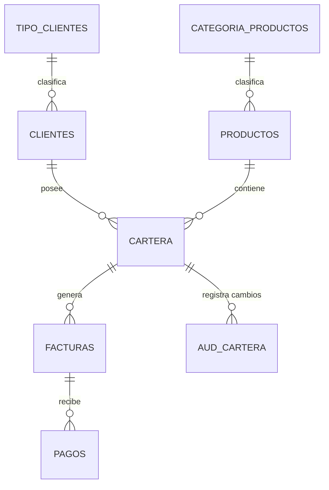

# 🚀 Customer Portfolio System (FinTech API)

Sistema empresarial para la gestión centralizada de carteras de clientes, desarrollado con **FastAPI**, **SQLModel** y **Oracle Database 21c**. Este sistema implementa un modelo híbrido que combina la agilidad de un backend moderno con la robustez de la lógica nativa en base de datos.

## 🏗️ Arquitectura del Sistema

El proyecto sigue una arquitectura modular de capas:
- **API Layer (FastAPI):** Endpoints RESTful asíncronos, inyección de dependencias y validación Pydantic v2.
- **Service Layer:** Orquestación de lógica de negocio y "bridge" hacia procedimientos PL/SQL.
- **Persistence Layer (SQLModel + Oracle):** Mapeo objeto-relacional (ORM) con soporte asíncrono nativo.
- **DB Layer (PL/SQL):** 
  - **Auditoría:** Registro automático de cambios de saldo mediante triggers.
  - **Transaccionalidad:** Transferencias de saldo atómicas mediante procedimientos almacenados.
  - **Reporting:** Vistas optimizadas para consultas de resumen.

## 🌟 Características Principales
- ✅ **Gestión de Clientes:** CRUD completo y clasificación por tipos.
- ✅ **Carteras Financieras:** Seguimiento de saldos, productos y vencimientos.
- ✅ **Ciclo de Facturación:** Modelado de facturas y registros de pagos.
- ✅ **Transferencias Blindadas:** Lógica de transferencia ejecutada directamente en el motor de DB.
- ✅ **Trazabilidad Total:** Auditoría nativa de movimientos de saldo.

## 📊 Diagrama Entidad-Relación (DER)



## 📂 Estructura del Proyecto

```text
├── alembic/              # Scripts de migración de base de datos
├── app/
│   ├── api/              # Routers y definiciones de endpoints
│   ├── core/             # Configuraciones globales y seguridad
│   ├── database/         # Conexión, motor asíncrono y scripts SQL
│   ├── models/           # Definiciones de SQLModel (Tablas)
│   ├── services/         # Lógica de negocio e integración PL/SQL
│   └── main.py           # Punto de entrada de la aplicación
├── tests/                # Suite de pruebas (Unitarias e Integración)
├── docker-compose.yml    # Orquestación de servicios (API + Oracle)
└── pyproject.toml        # Configuración de herramientas (Ruff, Pytest)
```

## 🛠️ Tecnologías
- **Backend:** Python 3.12, FastAPI, SQLModel.
- **Database:** Oracle 21c XE, `python-oracledb` (Async).
- **Quality:** Ruff (Linter), Pytest, GitHub Actions (CI).

## 🚀 Instalación y Despliegue

### 1. Requisitos
- Docker y Docker Compose.
- Python 3.12 (para desarrollo local).

### 2. Configuración
Crea un archivo `.env` basado en `.env.example`:
```env
DB_USER=system
ORACLE_PWD=Myoraclesecret
DB_HOST=db
DB_PORT=1521
DB_SERVICE_NAME=XEPDB1
```

### 3. Levantar con Docker
```bash
docker-compose up -d
```

### 4. Inicialización de Datos
```bash
# Aplicar migraciones
alembic upgrade head

# Poblar base de datos con datos de prueba
python seed_db.py
```

## 🔌 Documentación de la API
Una vez arriba, explora los endpoints de forma interactiva:
👉 **Swagger UI:** [http://localhost:8000/docs](http://localhost:8000/docs)

## 🔄 Flujo de Desarrollo

### Añadir un nuevo Modelo
1. Define la clase en `app/models/`.
2. Genera la migración: `alembic revision --autogenerate -m "descripción"`.
3. Aplica: `alembic upgrade head`.

### Ejecutar Pruebas
```bash
pytest -v
```

## ⚠️ Troubleshooting
- **Oracle Startup:** El contenedor de Oracle XE puede tardar de 2 a 4 minutos en estar listo para recibir conexiones en la PDB `XEPDB1`.
- **Conexión Externa:** Usa el puerto `1522` para herramientas como DBeaver o SQL Developer.

---
**Desarrollado con estándares de alta disponibilidad y mantenibilidad.**
