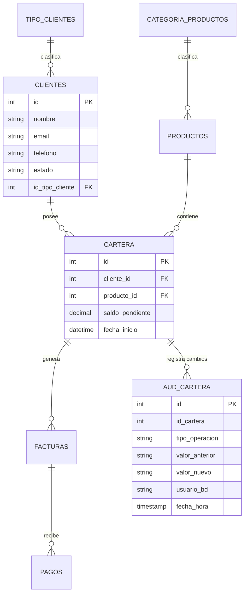

# 🚀 Customer Portfolio System (FinTech API)

Sistema empresarial para la gestión centralizada de carteras de clientes, desarrollado con **FastAPI**, **SQLModel** y **Oracle Database 21c**. El sistema utiliza lógica nativa PL/SQL para operaciones críticas y auditoría automática.

## 🏗️ Arquitectura del Sistema

El proyecto sigue una arquitectura de capas diseñada para escalabilidad y mantenibilidad:
- **API Layer (FastAPI):** Endpoints RESTful asíncronos.
- **Service Layer:** Lógica de negocio e integración con PL/SQL.
- **Persistence Layer (SQLModel + Oracle):** Modelado de datos y migraciones con Alembic.
- **DB Layer (PL/SQL):** Triggers de auditoría, Procedimientos de transferencia y Vistas de reporte.

## 📊 Diagrama Entidad-Relación (DER)



## 🛠️ Quick Start (Docker)

Sigue estos pasos para levantar el entorno completo en menos de 5 minutos:

### 1. Requisitos
- Docker y Docker Compose instalados.
- Python 3.10+ (opcional para desarrollo local).

### 2. Configuración
Crea un archivo `.env` basado en `.env.example`:
```bash
cp .env.example .env
```

### 3. Levantar el Sistema
```bash
# Levantar base de datos y API
docker-compose up -d
```

### 4. Inicializar Datos (Seed)
Una vez que Oracle esté listo (puedes verificar con `docker logs oracle_db`), ejecuta el script de poblado:
```bash
# Instalación de dependencias locales para el seed
pip install -r requirements.txt
python seed_db.py
```

## 🔌 Uso de la API

Una vez levantado el sistema, puedes acceder a la documentación interactiva:
👉 **Swagger UI:** [http://localhost:8000/docs](http://localhost:8000/docs)

### Endpoints Principales:
- `GET /clientes/`: Listado completo de clientes.
- `GET /cartera/resumen`: Vista consolidada de saldos.
- `POST /cartera/transferir`: Transferencia entre cuentas (Procedimiento PL/SQL).
- `GET /cartera/movimientos/{id}`: Historial de auditoría (Trigger).

## 🧪 Pruebas
Ejecuta la suite de pruebas unitarias y de integración:
```bash
pytest
```

---
**Desarrollado con ❤️ para entornos financieros de alta disponibilidad.**
